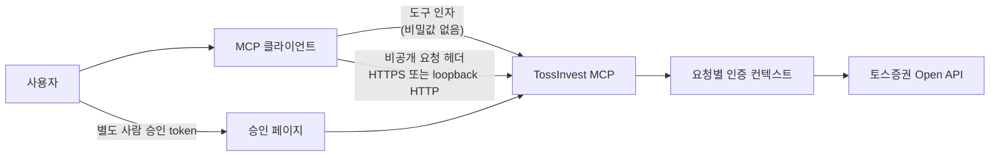

# TossInvest MCP

[English](README.en.md)

[토스증권 공식 Open API](https://developers.tossinvest.com/docs)를 MCP 클라이언트에서
사용하기 위한 독립 오픈소스 서버입니다. 기본 모드는 조회 전용이며, 거래 모드는 명시적인
프로세스 플래그와 별도 사람 승인을 모두 요구합니다.

> 이 프로젝트는 토스증권의 공식 제품이 아니며 투자 조언을 제공하지 않습니다.

## 보안 모델

- Toss API 키와 계좌 sequence는 MCP 서버의 `.env`나 컨테이너 환경에 저장하지 않습니다.
- 자격 증명은 MCP 클라이언트가 요청 헤더로 전달하고 서버는 요청별 인증 컨텍스트를 만듭니다.
- 자격 증명 헤더는 MCP 도구 schema와 도구 인자에 나타나지 않습니다.
- 요청별 OAuth token, HTTP client, 주문 preview는 자격 증명 fingerprint별로 격리됩니다.
- 공개 주소의 평문 HTTP 요청은 `426 https-required`로 거부합니다.
- 평문 HTTP는 loopback으로 게시한 로컬 서버와 내부 healthcheck에서만 허용합니다.
- MCP 응답은 `Cache-Control: no-store`이며 HTTPS 응답에는 HSTS를 추가합니다.
- Uvicorn access log는 기본적으로 끕니다. 애플리케이션 오류와 upstream 데이터의 인증·계좌
  필드는 redaction합니다.
- 주문 도구는 `--dangerously-enable-trading` 없이는 등록되지 않습니다.
- 모든 주문 생성·정정·취소는 2분짜리 preview, 별도 승인 페이지, 실행 직전 재검증을
  통과해야 하며 자동 재시도하지 않습니다.

## 구조



## 빠른 시작

필요한 것은 Python 3.12 또는 Docker, 그리고 토스증권 Open API `client_id`와
`client_secret`입니다.

```bash
git clone https://github.com/cha2hyun/tossinvest-mcp.git
cd tossinvest-mcp
cp .env.example .env
docker compose up -d --build
curl http://127.0.0.1:8000/healthz
```

서버 `.env`에는 포트와 캐시 같은 비밀이 아닌 운영 설정만 둡니다. 토스 키와 계좌값을
추가하지 마세요.

기본 로컬 주소:

| 용도 | 주소 |
| --- | --- |
| MCP | `http://127.0.0.1:8000/mcp` |
| 상태 | `http://127.0.0.1:8000/healthz` |
| 준비 상태 | `http://127.0.0.1:8000/readyz` |

요청별 인증 모드의 `/readyz`는 외부 API를 호출하거나 자격 증명을 검사하지 않고 서버가 요청을
받을 준비가 되었는지만 반환합니다.

## 서버 환경변수

| 변수 | 기본값 | 설명 |
| --- | --- | --- |
| `MCP_PUBLISHED_HOST` | `127.0.0.1` | Compose가 호스트에 바인딩할 주소 |
| `MCP_PUBLISHED_PORT` | `8000` | Compose가 공개할 포트 |
| `MCP_TENANT_CACHE_SIZE` | `100` | 메모리에 유지할 요청별 인증 컨텍스트 최대 수 |
| `MCP_TENANT_CACHE_TTL` | `3600` | 사용하지 않은 인증 컨텍스트 보존 시간(초) |
| `MCP_TRUSTED_PROXY_IPS` | `127.0.0.1` | forwarded scheme을 신뢰할 reverse proxy IP 목록 |
| `MCP_ALLOWED_ORIGINS` | 빈 값 | 브라우저 MCP 요청에 허용할 Origin 목록 |
| `TOSSINVEST_APPROVAL_BASE_URL` | `http://127.0.0.1:8000` | preview가 반환할 승인 페이지 origin |
| `TOSSINVEST_BASE_URL` | 공식 API 주소 | 테스트·호환 프록시용 upstream 주소 |
| `TOSSINVEST_REQUEST_TIMEOUT` | `15` | upstream timeout(초) |
| `LOG_LEVEL` | `INFO` | 서버 로그 레벨 |

직접 실행할 때만 `MCP_HOST`와 `MCP_PORT`를 사용할 수 있습니다. 이 두 값은 Compose 내부에서
각각 `0.0.0.0`, `8000`으로 고정됩니다.

## MCP 클라이언트 연결

토스 자격 증명은 MCP 서버가 아니라 클라이언트의 비밀 저장소에 둡니다. Hermes 예시는
`~/.hermes/.env`입니다.

```dotenv
TOSSINVEST_CLIENT_ID=발급받은_client_id
TOSSINVEST_CLIENT_SECRET=발급받은_client_secret
```

`~/.hermes/config.yaml`:

```yaml
mcp_servers:
  tossinvest:
    url: "http://127.0.0.1:8000/mcp"
    headers:
      X-Tossinvest-Client-Id: "${TOSSINVEST_CLIENT_ID}"
      X-Tossinvest-Client-Secret: "${TOSSINVEST_CLIENT_SECRET}"
    enabled: true
    timeout: 120
    connect_timeout: 30
    supports_parallel_tool_calls: false
```

이 헤더는 MCP 연결 계층이 자동으로 붙이며 모델의 도구 인자에는 포함되지 않습니다. 실제
자격 증명 값을 프롬프트, 채팅, Skill, tool argument에 복사하지 마세요.

조회 전용 allowlist 전체 예시는
[`examples/hermes-config.yaml`](examples/hermes-config.yaml), 클라이언트 환경변수 예시는
[`examples/hermes.env.example`](examples/hermes.env.example)에 있습니다.

## 계좌 자동 선택

서버는 `client_id`와 `client_secret`으로 OAuth token을 발급한 뒤 계좌 목록 API를 호출합니다.
계좌가 하나면 실제 `accountSeq`를 내부 메모리에서 자동 선택하므로 사용자가 sequence를 알거나
설정할 필요가 없습니다.

계좌가 여러 개면 서버는 임의로 주문 계좌를 선택하지 않습니다. `list_accounts`가 계좌번호와
sequence를 제거한 다음 `account_index`, 계좌 유형, 선택 상태만 반환합니다. 사용할 계좌의
1부터 시작하는 index를 MCP 연결 헤더에 추가하세요.

```yaml
X-Tossinvest-Account-Index: "${TOSSINVEST_ACCOUNT_INDEX}"
```

index는 실제 계좌값이 아니며 모델 도구 인자에도 들어가지 않습니다.

### VS Code

명령 팔레트의 `MCP: Open User Configuration`에서 여는 `mcp.json`에는 기본적으로
`client_id`와 `client_secret` 두 입력만 필요합니다. VS Code가 `${input:...}` 값을 처음
연결할 때 물어보고 보안 저장소에 보관합니다.

```json
{
  "inputs": [
    {
      "type": "promptString",
      "id": "tossinvest-client-id",
      "description": "TossInvest Client ID",
      "password": true
    },
    {
      "type": "promptString",
      "id": "tossinvest-client-secret",
      "description": "TossInvest Client Secret",
      "password": true
    }
  ],
  "servers": {
    "tossinvest": {
      "type": "http",
      "url": "http://127.0.0.1:8000/mcp",
      "headers": {
        "X-Tossinvest-Client-Id": "${input:tossinvest-client-id}",
        "X-Tossinvest-Client-Secret": "${input:tossinvest-client-secret}"
      }
    }
  }
}
```

실제 ID와 secret을 JSON에 직접 적지 마세요. `${input:...}`로 입력한 값은 연결 헤더에만
사용되며 모델이 생성하는 도구 JSON 인자에는 포함되지 않습니다. 공개 서버라면 `url`은 반드시
`https://`여야 합니다.

전체 조회 예제는 [`examples/vscode-mcp.json`](examples/vscode-mcp.json), 거래 모드 예제는
[`examples/vscode-mcp-trading.json`](examples/vscode-mcp-trading.json)에 있습니다.

다중 계좌에서만 다음 input과 header를 추가합니다.

```json
{
  "type": "promptString",
  "id": "tossinvest-account-index",
  "description": "TossInvest account index from list_accounts",
  "password": false
}
```

```json
{
  "X-Tossinvest-Account-Index": "${input:tossinvest-account-index}"
}
```

## 제공 도구

기본 조회 모드는 다음 16개 도구를 제공합니다.

| 구분 | 도구 |
| --- | --- |
| 종목·시세 | `get_stock_info`, `get_stock_warnings`, `get_prices`, `get_orderbook`, `get_recent_trades`, `get_price_limits`, `get_candles` |
| 시장 정보 | `get_exchange_rate`, `get_market_calendar` |
| 계좌·자산 | `list_accounts`, `get_holdings`, `get_buying_power`, `get_sellable_quantity`, `get_commissions` |
| 주문 조회 | `list_orders`, `get_order` |

## 거래 모드

거래 모드는 아래 세 조건을 모두 충족해야 합니다.

1. 서버를 `--dangerously-enable-trading`으로 시작
2. MCP 클라이언트가 주문 한도와 승인 token digest 헤더를 전달
3. 사용자가 별도 승인 페이지에서 원문 승인 token으로 preview를 승인

원문 승인 token은 비밀번호 관리자처럼 MCP 클라이언트와 서버 밖의 저장소에 보관합니다.
클라이언트에는 SHA-256 digest만 둡니다.

```bash
openssl rand -hex 32
read -rsp "Approval token: " APPROVAL_TOKEN
echo
printf '%s' "$APPROVAL_TOKEN" | openssl dgst -sha256 -r | awk '{print $1}'
unset APPROVAL_TOKEN
```

`~/.hermes/.env`에 추가:

```dotenv
TOSSINVEST_MAX_ORDER_KRW=1000000
TOSSINVEST_MAX_ORDER_USD=500
TOSSINVEST_APPROVAL_TOKEN_SHA256=64자리_sha256_digest
```

거래용 헤더와 allowlist는
[`examples/hermes-trading-config.yaml`](examples/hermes-trading-config.yaml)을 사용합니다.

```bash
docker compose \
  -f compose.yaml \
  -f compose.trading.yaml \
  up -d --build --force-recreate
```

등록되는 추가 도구:

| 작업 | preview | 실행 |
| --- | --- | --- |
| 생성 | `preview_order` | `place_order` |
| 정정 | `preview_order_modification` | `modify_order` |
| 취소 | `preview_order_cancellation` | `cancel_order` |

preview에는 승인 secret이 없으며, 승인되지 않은 실행은 `approval-required`로 거부됩니다.
승인 후에도 가격·환율·잔고·판매 가능 수량·주문 상태·한도를 다시 확인합니다. 네트워크 오류로
`order-state-unknown`이 반환되면 같은 주문을 재시도하지 말고 주문 내역을 먼저 확인하세요.

## 공개 배포

공개 서버는 반드시 TLS reverse proxy 뒤에 두세요.

- 외부 MCP URL과 `TOSSINVEST_APPROVAL_BASE_URL` 모두 `https://` 사용
- reverse proxy가 원래 scheme을 전달하고 그 주소만 `MCP_TRUSTED_PROXY_IPS`에 설정
- proxy access/error log에서 `X-Tossinvest-*`, `Authorization`, form body를 삭제 또는
  redaction
- request/response body dump, debug trace, APM header capture 비활성화
- MCP streaming 응답 buffering 비활성화
- `/healthz`, `/readyz`, `/approvals/*` 접근 범위 제한
- 방화벽, VPN 또는 별도 gateway 인증 추가
- 공개 포트가 필요할 때만 `MCP_PUBLISHED_HOST=0.0.0.0` 사용

애플리케이션은 HTTPS가 아닌 공개 요청을 거부하지만, TLS 종료와 proxy 로그 정책은 reverse
proxy 운영자가 책임져야 합니다.

## Docker 보안

기본 Compose는 loopback bind, non-root 사용자, read-only root filesystem, capability 제거,
`no-new-privileges`, 제한된 `/tmp`, 단일 worker를 사용합니다. 인증 컨텍스트와 preview는
메모리에 있으므로 서버 재시작 시 사라집니다. 현재 구조는 단일 instance 전제입니다.

## 개발과 검증

```bash
uv sync --all-extras
uv run pytest
uv run ruff check .
uv run ruff format --check .
uv run mypy src tests
uv run pip-audit --strict
uv run python scripts/check_docs.py
uv run python scripts/validate_skills.py
uv run python scripts/update_openapi.py --check
uv build
docker build .
```

보안 문제는 공개 Issue 대신 [SECURITY.md](SECURITY.md)의 절차로 신고하세요.
