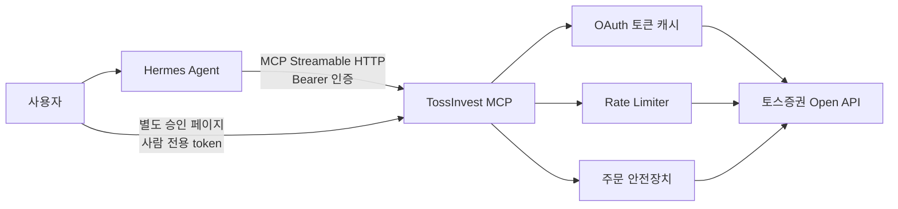

# TossInvest MCP

[English](README.en.md)

[토스증권 공식 Open API](https://developers.tossinvest.com/docs)를 Hermes Agent 같은 MCP
클라이언트에서 사용할 수 있도록 만든 오픈소스 MCP 서버입니다.

국내·미국 주식의 종목 정보와 시세, 계좌 자산, 주문 내역을 조회할 수 있습니다. 주문 기능은
기본적으로 꺼져 있으며, 별도로 활성화한 경우에도 미리보기와 MCP 채널 밖의 사람 승인 절차를
통과해야 주문 생성·정정·취소가 실행됩니다.

> 이 프로젝트는 토스증권의 공식 제품이 아닌 독립 오픈소스 프로젝트입니다. 투자 조언을
> 제공하지 않으며, 이 서버를 통해 실행한 주문과 그 결과에 대한 책임은 사용자에게 있습니다.

## 목차

- [주요 특징](#주요-특징)
- [동작 구조](#동작-구조)
- [빠른 시작](#빠른-시작)
- [토스증권 API 인증 정보 준비](#토스증권-api-인증-정보-준비)
- [환경변수 설정](#환경변수-설정)
- [Docker로 실행](#docker로-실행)
- [Hermes Agent 연결](#hermes-agent-연결)
- [Hermes Skill 설치](#hermes-skill-설치)
- [제공 도구](#제공-도구)
- [주문 기능 활성화](#주문-기능-활성화)
- [주문 안전장치](#주문-안전장치)
- [응답과 오류 형식](#응답과-오류-형식)
- [운영과 보안](#운영과-보안)
- [로컬 개발](#로컬-개발)
- [문제 해결](#문제-해결)
- [현재 제한사항](#현재-제한사항)

## 주요 특징

- 토스증권 Open API v1.1.1의 모든 조회 operation 지원
- OAuth 2.0 Client Credentials 토큰 자동 발급 및 메모리 캐시
- 토큰 만료 60초 전 선제 갱신과 동시 갱신 방지
- 공식 API 그룹별 로컬 rate limit 적용
- 조회 요청의 `429 Too Many Requests`만 제한적으로 재시도
- 주문 생성·정정·취소 요청은 어떤 경우에도 자동 재시도하지 않음
- 계좌번호와 account sequence를 MCP 응답에서 제거
- 기본 조회 전용 모드
- 주문 생성·정정·취소의 미리보기 → 별도 사람 승인 → 실행 흐름
- 에이전트 token과 분리된 사람 전용 승인 token
- 2분 후 만료되는 일회용 주문 승인 상태
- 원화·달러 주문 한도와 1억원 이상 주문의 강제 차단
- 국내 시장가 주문을 현재가가 아닌 공식 상한가 기준으로 보수적으로 검사
- 매수 가능 금액과 판매 가능 수량을 주문 미리보기 단계에서 검증
- Bearer 인증과 Origin 검사가 적용된 Streamable HTTP MCP
- 조회·미리보기·실행 위험도를 구분하는 MCP Tool annotation과 구조화된 응답 schema
- non-root, read-only filesystem, capability 제거가 적용된 Docker 구성
- 조회 전용과 거래 절차를 분리한 Hermes Agent Skill 제공

## 동작 구조



TossInvest MCP는 토스증권 인증 정보를 Hermes에 전달하지 않습니다. 서버가 내부적으로 OAuth
토큰을 발급하고, Hermes에는 필요한 MCP 도구와 정제된 결과만 노출합니다.

기본 실행 주소:

| 용도 | 주소 |
| --- | --- |
| MCP endpoint | `http://127.0.0.1:8000/mcp` |
| 프로세스 상태 | `http://127.0.0.1:8000/healthz` |
| 토스 API 인증 준비 상태 | `http://127.0.0.1:8000/readyz` |

## 빠른 시작

### 준비물

- 토스증권 Open API `client_id`, `client_secret`
- Docker 및 Docker Compose
- Hermes Agent
- 설정 파일을 편집할 수 있는 기본적인 터미널 환경

### 1. 저장소 받기

```bash
git clone https://github.com/cha2hyun/tossinvest-mcp.git
cd tossinvest-mcp
```

### 2. 환경변수 파일 만들기

```bash
cp .env.example .env
openssl rand -hex 32
```

출력된 임의 문자열은 `.env`의 `MCP_AUTH_TOKEN`에 넣습니다. 이 값은
`TOSSINVEST_CLIENT_SECRET`과 반드시 달라야 합니다.

최소 설정 예시:

```dotenv
TOSSINVEST_CLIENT_ID=발급받은_client_id
TOSSINVEST_CLIENT_SECRET=발급받은_client_secret
TOSSINVEST_ACCOUNT_SEQ=1

MCP_AUTH_TOKEN=openssl로_생성한_충분히_긴_임의_문자열
MCP_PUBLISHED_PORT=8000
LOG_LEVEL=INFO
```

`TOSSINVEST_ACCOUNT_SEQ`의 실제 값은 계좌마다 다를 수 있습니다. 확인 방법은
[계좌 sequence 확인](#계좌-sequence-확인)을 참고하세요.

### 3. 서버 실행

```bash
docker compose up -d --build
```

### 4. 상태 확인

```bash
curl http://127.0.0.1:8000/healthz
curl http://127.0.0.1:8000/readyz
docker compose ps
docker compose logs -f tossinvest-mcp
```

정상 상태 예시:

```json
{"status":"ok","service":"tossinvest-mcp"}
```

`readyz`는 토스증권 OAuth 토큰 발급까지 확인하므로 인증 정보가 잘못된 경우 `503`을
반환합니다.

## 토스증권 API 인증 정보 준비

1. 토스증권 WTS에 로그인합니다.
2. 설정의 Open API 메뉴에서 API 클라이언트를 등록합니다.
3. 발급된 `client_id`와 `client_secret`을 안전하게 보관합니다.
4. 두 값은 TossInvest MCP 서버의 `.env`에만 저장합니다.

`client_secret`은 Git 저장소, Hermes 설정, 프롬프트, 채팅, 로그에 넣으면 안 됩니다.

### 계좌 sequence 확인

계좌·자산·주문 API는 `X-Tossinvest-Account` 헤더에 `accountSeq`가 필요합니다. 이 값은
계좌번호가 아니며, 토스증권의 계좌 목록 API에서 확인합니다.

`jq`가 설치된 로컬 터미널에서 다음처럼 조회할 수 있습니다.

```bash
set -a
source .env
set +a

ACCESS_TOKEN="$(
  curl -fsS -X POST 'https://openapi.tossinvest.com/oauth2/token' \
    -H 'Content-Type: application/x-www-form-urlencoded' \
    --data-urlencode 'grant_type=client_credentials' \
    --data-urlencode "client_id=${TOSSINVEST_CLIENT_ID}" \
    --data-urlencode "client_secret=${TOSSINVEST_CLIENT_SECRET}" |
  jq -r '.access_token'
)"

curl -fsS 'https://openapi.tossinvest.com/api/v1/accounts' \
  -H "Authorization: Bearer ${ACCESS_TOKEN}" |
jq '.result[] | {accountSeq, accountType}'

unset ACCESS_TOKEN
```

출력된 `accountSeq`를 `.env`의 `TOSSINVEST_ACCOUNT_SEQ`에 설정합니다. 위 명령은 계좌 식별
정보를 다루므로 출력 내용을 공유하거나 저장소에 남기지 마세요.

MCP의 `list_accounts` 도구는 보안을 위해 원본 계좌번호와 `accountSeq`를 반환하지 않습니다.
계좌 유형과 현재 서버에 설정된 계좌인지 여부만 제공합니다.

## 환경변수 설정

| 변수 | 필수 조건 | 기본값 | 설명 |
| --- | --- | --- | --- |
| `TOSSINVEST_CLIENT_ID` | 항상 | 없음 | 토스증권 Open API 클라이언트 ID |
| `TOSSINVEST_CLIENT_SECRET` | 항상 | 없음 | 토스증권 Open API 클라이언트 secret |
| `TOSSINVEST_ACCOUNT_SEQ` | 계좌·주문 도구 | 없음 | 서버가 사용할 고정 계좌 sequence |
| `TOSSINVEST_MAX_ORDER_KRW` | 주문 활성화 | 없음 | 단일 원화 주문 최대 금액 |
| `TOSSINVEST_MAX_ORDER_USD` | 주문 활성화 | 없음 | 단일 달러 주문 최대 금액 |
| `TOSSINVEST_APPROVAL_TOKEN_SHA256` | 주문 활성화 | 없음 | 사람 전용 승인 token의 SHA-256 hex digest |
| `TOSSINVEST_APPROVAL_BASE_URL` | 선택 | `http://127.0.0.1:8000` | 미리보기에 표시할 승인 페이지 주소 |
| `TOSSINVEST_BASE_URL` | 선택 | 공식 API 주소 | 테스트 또는 호환 프록시용 API 주소 |
| `TOSSINVEST_REQUEST_TIMEOUT` | 선택 | `15` | 토스 API 요청 timeout(초) |
| `MCP_AUTH_TOKEN` | 항상 | 없음 | MCP 연결에 사용하는 Bearer token, 최소 16자 |
| `MCP_ALLOWED_ORIGINS` | 선택 | 빈 값 | 허용할 브라우저 Origin의 쉼표 구분 목록 |
| `MCP_HOST` | 직접 실행 | `0.0.0.0` | Compose 외 직접 실행 시 listen 주소 |
| `MCP_PORT` | 직접 실행 | `8000` | Compose 외 직접 실행 시 listen 포트 |
| `MCP_PUBLISHED_PORT` | Docker Compose | `8000` | 호스트에 공개할 포트 |
| `LOG_LEVEL` | 선택 | `INFO` | 서버 로그 레벨 |

주의사항:

- `.env`는 `.gitignore`에 포함되어 있지만 별도로 백업·공유하지 않는 것이 안전합니다.
- `MCP_AUTH_TOKEN`은 토스증권 `client_secret`과 다른 값이어야 합니다.
- 사람 전용 승인 token은 MCP token과 토스증권 secret 모두와 달라야 합니다.
- 주문 기능을 켜면 계좌 sequence, 두 통화의 주문 한도, 승인 token이 모두 필요합니다.
- 원문 승인 token은 서버 `.env`, Hermes 환경변수, Hermes 설정에 넣지 마세요. 서버에는
  `TOSSINVEST_APPROVAL_TOKEN_SHA256`만 저장합니다.
- Hermes에 서버 `.env`를 읽을 수 있는 filesystem/shell 권한을 부여하면 승인 경계가 무너집니다.
- 빈 주문 한도는 무제한을 의미하지 않습니다. 주문 활성화 시 서버 시작 실패로 처리됩니다.

## Docker로 실행

### 빌드와 시작

```bash
docker compose up -d --build
```

### 로그 확인

```bash
docker compose logs -f tossinvest-mcp
```

### 재시작

```bash
docker compose restart tossinvest-mcp
```

### 종료

```bash
docker compose down
```

### 다른 호스트 포트 사용

`.env`:

```dotenv
MCP_PUBLISHED_PORT=18000
```

이 경우 MCP 주소는 `http://127.0.0.1:18000/mcp`가 됩니다. Hermes 설정의 URL도 같은 포트로
수정해야 합니다. 거래 기능을 사용한다면 승인 URL도 같은 포트를 가리키도록 설정합니다.

```dotenv
TOSSINVEST_APPROVAL_BASE_URL=http://127.0.0.1:18000
```

Compose는 기본적으로 포트를 `127.0.0.1`에만 바인딩합니다. 같은 컴퓨터에서 실행되는
Hermes만 접근할 수 있는 구성이며, 특별한 이유 없이 `0.0.0.0`으로 공개하지 마세요.

### 공개 이미지 사용

릴리스 태그가 발행된 이후에는 GHCR 이미지를 사용할 수 있습니다.

```bash
docker pull ghcr.io/cha2hyun/tossinvest-mcp:latest
docker compose up -d
```

특정 버전을 운영 환경에 고정하려면 `latest` 대신 SemVer 태그를 사용하는 것을 권장합니다.

## Hermes Agent 연결

### 1. Hermes용 토큰 저장

`~/.hermes/.env`:

```dotenv
TOSSINVEST_MCP_AUTH_TOKEN=.env의_MCP_AUTH_TOKEN과_동일한_값
```

`Bearer ` 접두사는 이 파일에 넣지 않습니다.

### 2. MCP 서버 설정 추가

`~/.hermes/config.yaml`의 최상위 `mcp_servers` 아래에 추가합니다.

```yaml
mcp_servers:
  tossinvest:
    url: "http://127.0.0.1:8000/mcp"
    headers:
      Authorization: "Bearer ${TOSSINVEST_MCP_AUTH_TOKEN}"
    enabled: true
    timeout: 120
    connect_timeout: 30
    supports_parallel_tool_calls: false
    tools:
      include:
        - get_stock_info
        - get_stock_warnings
        - get_prices
        - get_orderbook
        - get_recent_trades
        - get_price_limits
        - get_candles
        - get_exchange_rate
        - get_market_calendar
        - list_accounts
        - get_holdings
        - list_orders
        - get_order
        - get_buying_power
        - get_sellable_quantity
        - get_commissions
      resources: false
      prompts: false
```

동일한 예제는 [`examples/hermes-config.yaml`](examples/hermes-config.yaml)에도 있습니다.

### 3. 연결 확인

```bash
hermes mcp test tossinvest
```

조회 전용 기본 모드에서는 16개 도구가 보여야 하며, `place_order`, `modify_order`,
`cancel_order` 같은 주문 실행 도구는 보이면 안 됩니다.

## Hermes Skill 설치

MCP 도구는 “무엇을 실행할 수 있는지”를 제공하고, Skill은 Hermes에 “어떤 순서와 안전
규칙으로 사용해야 하는지”를 알려줍니다.

```bash
mkdir -p ~/.hermes/skills
cp -R skills/tossinvest ~/.hermes/skills/
cp -R skills/tossinvest-trading ~/.hermes/skills/
hermes skills list | grep tossinvest
```

설치 후 새 Hermes 세션을 시작합니다. `tossinvest`는 조회 절차만 안내합니다.
`tossinvest-trading`은 거래 도구가 실제로 등록된 경우에만 나타나며 다음 흐름을 안내합니다.

1. 종목과 시장 확인
2. 장 운영 시간 확인
3. 종목 경고 조회
4. 매수 가능 금액 또는 판매 가능 수량 확인
5. 주문 미리보기와 승인 URL 제시
6. 사용자가 별도 승인 페이지에서 주문 내용 확인
7. 사람 전용 token으로 승인한 뒤 한 번만 주문 실행
8. 주문 상세 재조회
9. 상태가 불명확하면 재주문하지 않고 주문 내역 확인

Skill은 행동 지침이며 보안 경계가 아닙니다. 거래 제한과 확인 절차는 MCP 서버도 독립적으로
강제합니다.

## 제공 도구

Hermes에서는 서버 이름이 도구명 앞에 붙어 `mcp_tossinvest_get_prices`처럼 보일 수 있습니다.
아래 표는 MCP 서버 내부 도구명을 기준으로 합니다.

### 종목·시세

| 도구 | 설명 | 주요 입력 |
| --- | --- | --- |
| `get_stock_info` | 종목명, 시장, 통화, 상장 상태 등 종목 기본 정보 | `symbols` |
| `get_stock_warnings` | 투자경고, 위험, 과열, VI 등 매수 유의사항 | `symbol` |
| `get_prices` | 최대 200개 종목의 현재가 | `symbols` |
| `get_orderbook` | 매수·매도 호가 | `symbol` |
| `get_recent_trades` | 최근 체결 내역, 최대 50건 | `symbol`, `count` |
| `get_price_limits` | 국내 종목 상한가·하한가 | `symbol` |
| `get_candles` | 1분봉 또는 일봉 OHLCV | `symbol`, `interval`, `count` |

여러 종목을 받는 `symbols` 입력은 쉼표로 구분합니다.

```text
005930,000660,AAPL
```

### 시장 정보

| 도구 | 설명 | 주요 입력 |
| --- | --- | --- |
| `get_exchange_rate` | KRW/USD 환율 | `base_currency`, `quote_currency` |
| `get_market_calendar` | 한국 또는 미국 장 운영 시간 | `market`, `date` |

### 계좌·자산

| 도구 | 설명 | 주요 입력 |
| --- | --- | --- |
| `list_accounts` | 식별 정보를 제거한 계좌 유형과 선택 상태 | 없음 |
| `get_holdings` | 보유 주식과 평가·손익 정보 | 선택적 `symbol` |
| `get_buying_power` | 현금 기반 매수 가능 금액 | `currency` |
| `get_sellable_quantity` | 현재 판매 가능한 수량 | `symbol` |
| `get_commissions` | 국내·미국 시장별 수수료 | 없음 |

### 주문 조회

| 도구 | 설명 | 주요 입력 |
| --- | --- | --- |
| `list_orders` | 진행 중 또는 종료 주문 목록 | `status`, 날짜, cursor |
| `get_order` | 주문 한 건의 상태와 체결 결과 | `order_id` |

### 주문 실행

다음 도구는 서버를 `--dangerously-enable-trading` 인자로 시작했을 때만 등록됩니다.

| 단계 | 미리보기 도구 | 실행 도구 |
| --- | --- | --- |
| 주문 생성 | `preview_order` | `place_order` |
| 주문 정정 | `preview_order_modification` | `modify_order` |
| 주문 취소 | `preview_order_cancellation` | `cancel_order` |

## 주문 기능 활성화

먼저 충분히 낮은 주문 한도로 시작하세요.

사람 전용 승인 token을 32-byte 난수로 생성하고 비밀번호 관리자 등 서버·Hermes 밖의 안전한
장소에 저장합니다. 원문 token은 `.env`에 넣지 않습니다.

```bash
openssl rand -hex 32
```

저장한 token을 화면에 다시 노출하지 않고 SHA-256 digest를 계산합니다.

```bash
read -rsp "Approval token: " APPROVAL_TOKEN
echo
printf '%s' "$APPROVAL_TOKEN" | openssl dgst -sha256 -r | awk '{print $1}'
unset APPROVAL_TOKEN
```

출력된 64자리 digest만 `.env`에 설정합니다.

```dotenv
TOSSINVEST_ACCOUNT_SEQ=1
TOSSINVEST_MAX_ORDER_KRW=1000000
TOSSINVEST_MAX_ORDER_USD=500
TOSSINVEST_APPROVAL_TOKEN_SHA256=승인_token의_64자리_sha256_digest
TOSSINVEST_APPROVAL_BASE_URL=http://127.0.0.1:8000
```

환경변수만으로는 주문 기능을 활성화할 수 없습니다. 기본 `compose.yaml`에 거래 전용 override
파일을 명시적으로 추가하여 서버 시작 명령에 위험 인자를 전달해야 합니다.

```bash
docker compose \
  -f compose.yaml \
  -f compose.trading.yaml \
  up -d --build --force-recreate
```

직접 실행할 때는 다음과 같습니다.

```bash
uv run tossinvest-mcp --dangerously-enable-trading
```

`TOSSINVEST_ENABLE_TRADING=true` 같은 환경변수는 주문 기능을 열지 않습니다. 정확한
`--dangerously-enable-trading` 인자가 필요합니다.

Hermes allowlist에도 주문 도구를 명시적으로 추가해야 합니다.
전체 예시는 [`examples/hermes-trading-config.yaml`](examples/hermes-trading-config.yaml)에
있습니다.

```yaml
tools:
  include:
    # 기존 조회 도구
    - preview_order
    - place_order
    - preview_order_modification
    - modify_order
    - preview_order_cancellation
    - cancel_order
```

거래 활성화 모드에서는 총 22개 도구가 등록됩니다.

## 주문 안전장치

### 1. 거래 도구 기본 비노출

기본 `tossinvest-mcp` 명령과 기본 `compose.yaml`은 주문 도구를 MCP 도구 목록 자체에
등록하지 않습니다. 주문 도구를 열려면 서버 시작 시 `--dangerously-enable-trading`을
명시해야 합니다.

### 2. MCP 채널과 분리된 사람 승인

주문을 바로 실행할 수 없습니다. 먼저 미리보기 도구를 호출해야 합니다.

미리보기는 다음 정보를 반환합니다.

- `preview_id`
- 사람이 열어야 하는 `approval_url`
- 종목, 방향, 가격, 수량 또는 금액
- 현재가와 예상 주문 금액
- 원화 환산 예상 금액
- 종목 경고와 장 운영 정보
- 매수 가능 금액 또는 판매 가능 수량

미리보기 응답에는 주문을 승인할 수 있는 secret이나 확인 문구가 들어 있지 않습니다.
에이전트가 `place_order`, `modify_order`, `cancel_order`를 바로 호출하면 서버는
`approval-required`로 거부하며 토스증권 주문 API를 호출하지 않습니다.

사람은 `approval_url`을 브라우저로 열어 정확한 주문 내용을 확인하고,
별도로 보관한 원문 승인 token을 입력해야 합니다. 서버는 입력값의 SHA-256 digest만 비교하며
원문 token을 저장하지 않습니다. 이 token은 Hermes에 전달하지 않는 별도 credential입니다.
승인 상태는 한 번 사용하면 폐기되며, 2분이 지나거나 서버가 재시작되면 새 미리보기가
필요합니다. Origin이 없거나 일치하지 않는 승인 요청은 거부하며 반복 요청과 preview별
실패 횟수도 제한합니다.

```text
Hermes MCP token ── 미리보기/실행 요청
사람 승인 token  ── 별도 웹 승인
두 조건 모두 충족 ── 토스증권 주문 POST
```

### 3. 주문 금액 제한

- `TOSSINVEST_MAX_ORDER_KRW`
- `TOSSINVEST_MAX_ORDER_USD`
- 원화 환산 1억원 이상 주문의 강제 차단

미국 주문은 공식 환율로 원화 가치를 계산하여 1억원 제한도 함께 검사합니다.

### 4. 시장가 주문의 보수적 검사

국내 시장가 주문은 현재가가 아닌 공식 상한가를 기준으로 예상 금액과 매수 가능 금액을
검사합니다. 실제 주문 시점의 가격 변동으로 설정 한도를 넘어갈 가능성을 줄이기 위한
정책입니다.

공식 상한가로 절대 한도를 계산할 수 없는 미국 수량 기반 시장가 주문은 거부합니다. 미국
시장가 주문은 지원되는 경우 고정 `order_amount`를 사용해야 하며, 미국 시장가 정정도
거부합니다.

### 5. 실행 직전 재검증

사람 승인 후 실행 도구가 호출되면 서버는 가격, 환율, 매수 가능 금액 또는 판매 가능 수량,
주문 상태와 설정 한도를 다시 조회합니다. 상태가 달라졌거나 한도를 넘으면 해당 preview를
폐기하고 `preview-state-changed`를 반환합니다. 변경된 상태로 새 preview와 새 승인이
필요합니다.

### 6. 주문 자동 재시도 금지

주문 생성·정정·취소는 토큰 만료 응답, rate limit, timeout, 네트워크 오류가 발생해도
자동으로 재전송하지 않습니다.

전송 이후 연결이 끊겨 주문 성공 여부를 알 수 없으면 다음 오류를 반환합니다.

```text
order-state-unknown
```

이 경우 같은 주문을 다시 실행하지 말고 `list_orders`와 `get_order`로 상태부터 확인해야
합니다.

### 7. 멱등성

주문 생성 시 서버가 `clientOrderId`를 자동 생성합니다. 토스증권은 이 값을 기준으로 10분간
멱등성을 제공합니다. 다만 이 기능을 믿고 애플리케이션이 주문을 자동 재시도하지는 않습니다.

## 응답과 오류 형식

정상적인 Toss API 결과는 다음 형태로 정규화됩니다.

```json
{
  "data": {},
  "meta": {
    "request_id": "토스증권 요청 식별자",
    "retrieved_at": "2026-06-18T04:00:00+00:00",
    "rate_limit": {
      "limit": "10",
      "remaining": "9",
      "reset": "0.1"
    }
  }
}
```

`request_id`는 토스증권 문의나 장애 추적 시 유용합니다.

예상 가능한 오류는 MCP ToolError 안에 다음 정보가 포함됩니다.

```json
{
  "error": {
    "status_code": 429,
    "code": "rate-limit-exceeded",
    "message": "요청 한도를 초과했습니다.",
    "request_id": "request-id",
    "data": null
  }
}
```

토스증권 Authorization header, OAuth access token, client secret, account sequence와 승인
token digest는 MCP 도구 schema, 결과, resource, prompt에 노출하지 않습니다.

## 운영과 보안

기본 Compose 보안 설정:

- 호스트의 `127.0.0.1`에만 포트 공개
- 컨테이너 non-root 사용자 실행
- read-only root filesystem
- Linux capability 전체 제거
- `no-new-privileges`
- `/tmp`만 제한된 임시 filesystem으로 제공
- healthcheck와 자동 재시작
- Uvicorn 단일 worker

### 외부 서버에 배포할 때

이 저장소의 Compose 포트를 그대로 인터넷에 공개하면 안 됩니다.

- HTTPS reverse proxy 사용
- MCP streaming 응답을 buffering하지 않도록 설정
- 방화벽 또는 사설망으로 접근 제한
- 충분히 긴 `MCP_AUTH_TOKEN` 사용
- secret manager 사용
- `/healthz`, `/readyz`의 외부 접근 제한
- Hermes allowlist 최소화
- 주문 한도를 낮게 시작

자세한 내용은 [SECURITY.md](SECURITY.md)를 참고하세요.

## 로컬 개발

Python 3.12와 [uv](https://docs.astral.sh/uv/)가 필요합니다.

```bash
uv sync --all-extras
```

서버 직접 실행:

```bash
cp .env.example .env
uv run tossinvest-mcp
```

검증:

```bash
uv run pytest
uv run ruff check .
uv run ruff format --check .
uv run mypy src
uv run pip-audit --strict
uv run python scripts/update_openapi.py --check
docker build .
```

공식 OpenAPI 검사기는 다음을 확인합니다.

- API 버전
- 전체 OpenAPI 문서의 SHA-256 fingerprint
- 모든 HTTP operation
- 공식 `operationId`와 MCP 구현의 매핑

공식 스키마 변경을 검토한 뒤 manifest를 갱신하려면:

```bash
uv run python scripts/update_openapi.py --update
```

## 문제 해결

### `401 Unauthorized`

MCP 요청의 `Authorization` header를 확인하세요.

```text
Authorization: Bearer <MCP_AUTH_TOKEN>
```

Hermes의 `TOSSINVEST_MCP_AUTH_TOKEN`에는 `Bearer ` 없이 토큰 값만 저장해야 합니다.

### `/readyz`가 `503`을 반환함

- `TOSSINVEST_CLIENT_ID` 확인
- `TOSSINVEST_CLIENT_SECRET` 확인
- 컨테이너의 외부 네트워크 연결 확인
- 토스증권 Open API 점검 여부 확인

```bash
docker compose logs tossinvest-mcp
```

### `account-not-configured`

`.env`에 올바른 `TOSSINVEST_ACCOUNT_SEQ`가 필요합니다. 값을 수정한 뒤 컨테이너를 다시
생성하세요.

```bash
docker compose up -d --force-recreate
```

### 거래 도구가 보이지 않음

다음을 모두 확인하세요.

1. Docker 실행 시 `compose.trading.yaml`을 함께 지정했는지 확인
2. 직접 실행 시 `--dangerously-enable-trading`을 사용했는지 확인
3. 원화·달러 주문 한도와 사람 승인 token이 모두 설정됐는지 확인
4. 컨테이너가 설정 변경 후 다시 생성됐는지 확인
5. Hermes `tools.include`에 거래 도구가 추가됐는지 확인

### `approval-required`

미리보기 결과의 `approval_url`을 사람이 직접 브라우저로 열고 주문 내용을 확인해야 합니다.
승인 페이지에서 서버 밖에 별도로 보관한 원문 승인 token을 입력한 뒤 실행 도구를 다시
호출하세요. `.env`에는 원문이 아니라 `TOSSINVEST_APPROVAL_TOKEN_SHA256`만 있어야 합니다.

승인 token을 Hermes 채팅, Hermes 환경변수, Skill, MCP 입력에 복사하면 안 됩니다.

### `preview-state-changed`

승인 후 실행 직전 재검증에서 가격, 환율, 잔고, 판매 가능 수량 또는 주문 상태가 달라졌습니다.
기존 preview는 폐기됩니다. 변경된 내용을 확인하고 새 preview부터 다시 진행하세요.

### `unbounded-market-order`

설정 한도를 보수적으로 보장할 수 없는 시장가 요청입니다. 미국 시장가 신규 주문은 고정
`order_amount`를 사용하고, 시장가 정정은 지정가 정정으로 바꾸어 새 preview를 만드세요.

### `origin-not-allowed`

브라우저 기반 MCP 클라이언트가 `Origin` header를 보내는 경우 해당 주소를 설정합니다.

```dotenv
MCP_ALLOWED_ORIGINS=https://agent.example.com,https://another.example.com
```

Origin을 보내지 않는 일반 서버 클라이언트와 Hermes 로컬 연결은 이 목록이 비어 있어도
사용할 수 있습니다.

### `order-state-unknown`

주문 요청이 전송된 뒤 응답을 받지 못한 상태입니다. 절대 같은 실행 도구를 반복 호출하지
마세요.

1. `list_orders(status="OPEN")` 조회
2. 종료 주문도 필요하면 `list_orders(status="CLOSED")` 조회
3. 발견된 주문 ID를 `get_order`로 확인
4. 주문 존재 여부가 확정되기 전까지 새 주문 금지

### `rate-limit-exceeded`

조회 요청은 서버가 `Retry-After`를 따라 제한적으로 재시도합니다. 계속 발생하면 호출 빈도를
줄이세요. 주문 요청은 rate limit 오류가 발생해도 자동 재시도하지 않습니다.

## 현재 제한사항

- 토스증권 Open API가 제공하는 REST API만 사용합니다.
- WebSocket 기반 실시간 스트리밍을 제공하지 않습니다.
- 시세 갱신이 필요한 에이전트는 조회 API를 polling해야 합니다.
- OAuth token과 주문 preview는 메모리에만 저장됩니다.
- 서버 재시작 시 기존 preview와 승인 상태는 무효화됩니다.
- 안전한 일회용 preview를 위해 단일 worker로 실행합니다.
- 현재 구성은 단일 인스턴스를 전제로 하며 수평 확장용 공유 상태 저장소가 없습니다.
- 공식 모의투자 또는 sandbox가 문서화되지 않은 경우 실계좌 주문 테스트가 될 수 있습니다.
- CI는 실제 토스증권 계정에 연결하거나 실주문을 실행하지 않습니다.

## 기여

버그 수정, 문서 개선, 테스트 추가를 환영합니다. 시작하기 전에
[CONTRIBUTING.md](CONTRIBUTING.md)와 [CODE_OF_CONDUCT.md](CODE_OF_CONDUCT.md)를
확인하세요.

보안 취약점은 공개 Issue 대신 [SECURITY.md](SECURITY.md)의 비공개 신고 절차를 이용하세요.

## 라이선스

[MIT License](LICENSE)

Copyright (c) 2026 cha2hyun
